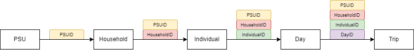

----
National Travel Survey (NTS) Processing  is Transport for the North's (TfN) suite of tools to build an NTS dataset from raw inputs via a special data licence supplied by the UK Data Service. Furthermore, there are a multitiude of outputs these tools build, where the vast majority are inputs for the production model of TfN's Travel Marker Synthesiser within [NorMITs-Demand](https://github.com/Transport-for-the-North/NorMITs-Demand#travel-market-synthesiser)

#### Contents
 - [Summary](#summary) 
 - [Quick Start Guide](#quick-start-guide)
 - [Required Data](#required-data)
   - [NoTEM](#notem)
   - [TMS](#tms)
   - [EFS](#efs)
   - [Elasticity](#elasticity)
 - [Documentation](#documentation)
 - [Planned Improvements](#planned-improvements)
 - [Sharing](#sharing)
   - [Sharing Models](#sharing-models)
   - [Sharing Requests](#sharing-requests)
 - [Gory Details](#gory-details)
   - [Northern Trip End Model](#northern-trip-end-model)
   - [Travel Market Synthesiser](#travel-market-synthesiser)
   - [External Forecast System](#external-forecast-system)
   - [Elasticity](#elasticity-model)
   - [NorMITs Matrix Tools](#matrix-tools)

## [Summary](#contents)
NTS Processing is an ordered sequence, where the first process returns in the inputs for the 2nd process and so forth. This is represented in the OP flow model below. A summary of each process is detailed in chronological order below:

- [Unclassified Build](#unclassified-build) (**UB**) - Reads in raw NTS data and joins tables together by utilising the hierarchical nature of the NTS to flexibily create an 'unclassified build' by specifiying the tables and variables within each table to join.
- [Classified Build](#classified-build) (**CB**) - 

It then classfies this build based on classifications relevant to TfN's Analtitical Framework models.
Using classified build, we create trip rates, mode time splits and productions - reporting comparisons of these data sets to CTripEnd.

## Backlog
Non-homebased trip rates and time splits

National Travel Survey analysis routines

## Overview
A suite of tools to read in NTS raw data using its hierarchical data format and joins tables to create an 'unclassified build'.
It then classfies this build based on classifications relevant to TfN's Analtitical Framework models.
Using classified build, we create trip rates, mode time splits and productions - reporting comparisons of these data sets to CTripEnd.

## Backlog
Non-homebased trip rates and time splits
