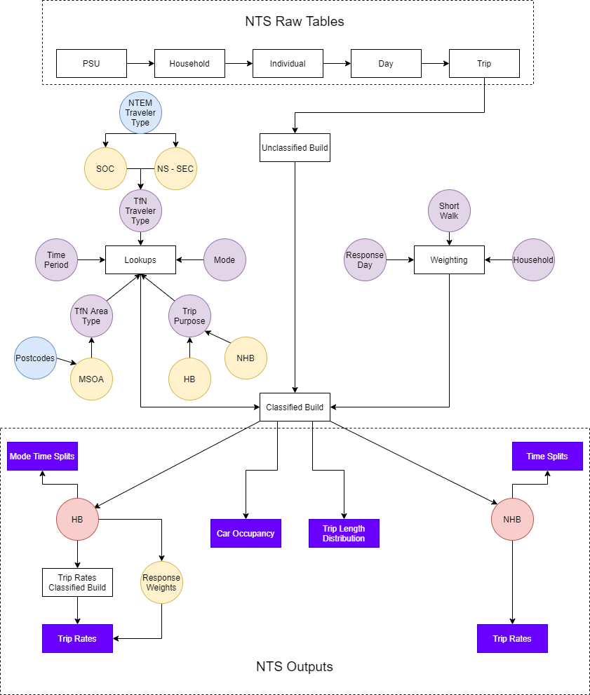

----

# NTS Processing

National Travel Survey (NTS) Processing  is Transport for the North's (TfN) suite of tools to build an NTS dataset from raw inputs via a special data licence supplied by the UK Data Service. Furthermore, there are a multitiude of Home Based (HB) and Non-Home Based (NHB) outputs these tools build, where the vast majority are inputs for the production model of TfN's Travel Marker Synthesiser within [NorMITs-Demand](https://github.com/Transport-for-the-North/NorMITs-Demand#travel-market-synthesiser)

#### Contents
 - [Summary](#summary) 
 - [Quick Start Guide](#quick-start-guide)
 - [Required Data](#required-data)
 - [Documentation](#documentation)
 - [Planned Improvements](#planned-improvements)
 - [Sharing](#sharing)
 - [Functionality](#functionality)
   - [Lookups](#lookups)
   - [Unclassified Build](#ub)
   - [Classified Build](#cb)
   - [HB Trip Rates](#hb_trip-rates)
   - [HB Mode Time Splits](#hb-mts) - 
   - [HB Production Model](#hb-production-model) - 
   - [NHB Trip Rates](#nhb-trip-rates) - 
   - [NHB Time Splits](#nhb-time_splits) - 
   - [Car Occupancy](#car-occupancy) - 
   - [Trip Length Distributions](#tld)

## [Summary](#contents)
NTS Processing is an ordered sequence, where the unclassified build becomes the input for the classified build which becomes the main input for all outputs. This is represented in the OP flow model below. A summary of each process is detailed in chronological order below:

1. [Unclassified Build](#ub) (**UB**) - Reads in raw NTS data and joins tables together by utilising the hierarchical nature of the NTS to flexibily create an 'unclassified build' by specifiying the tables and variables within each table to join.
2. [Classified Build](#cb) (**CB**) - 
3. [HB Trip Rates](#hb_trip-rates) - 
4. [HB Mode Time Splits](#hb-mts) - 
5. [HB Production Model](#hb-production-model) - 
6. [NHB Trip Rates](#nhb-trip-rates) - 
7. [NHB Time Splits](#nhb-time_splits) - 
8. [Car Occupancy](#car-occupancy) - 
9. [Trip Length Distributions](#tld)

One important requisite deserving explanation is the Lookup process implemented to flexibly adjust and/or add new variables.

## [Quick Start Guide!](#contents)
In order to smoothly run the tools, follow the steps below:

1.	Open run_master.R and execute lines 1-12. If this is your first time, then this will create a folder 'NTS_C' and copy the required inputs from Y drive to your C drive within documents. For example: C:\Users\Pluto\Documents\NTS_C
2.	It is better to run with ‘drive = C’ whenever a function has the option as an argument due to slow speeds with the Y drive. This is particularly important for build_ub as raw NTS tsv’s are not saved on the Y drive.
3.	If granted access to raw NTS data, save within NTS_C. For example: C:\Users\Pluto\Documents\NTS_C\UKDA-7553-tab\tab

## [Required Data](#contents)
In order to run NTS Processing from start to finish, i.e. obtain all outputs, there are certain dependencies on inputs which are listed for each wrapper function. The minimum required to obtain a classified build is:

1. All lookups obtained from running step 1 in Quick start guide.
2. Raw NTS tsv's with an 'extraction_cols.csv' OR a pre-made unclassified build csv.

## [Documentation](#contents)
Currently code documentation ca be found in sharepoint. There are planned improvements to hosting this online.

## [Planned improvements](#contents)
There is one major improvement due early 2022. The format will change to support an R package structure. Code will also be more 'strict' to avoid incorrect errors. The final addition is to add sanity checks within all functions, particularly UB and CB, to ensure any filtering processes are applied correctly.

## [Sharing](#contents)
TfN's Technical Assurance, Modelling and Economics (**TAME**) team have done
a great deal of work to develop TfN’s Analytical Framework.
As part of this, we would like to start sharing some of our tools, NTS Processing included.

## [Functionality](#contents)

Notes:
Inputs and Outputs in *italics* are optional.

#### [Lookups](#contents)
A unique procedure has been implemented to swiftly add or adjust lookups. A lookup in this context refers to adding new variables to the classified build based on variables available within the unclassified build. This section explains the format of a csv lookup input to allow you to create your own lookups. A detailed explanation with an example is provided within the NTS Processing Code Note.

#### [Unclassified Build](#contents)

**name:** build_ub.R

**inputs:**
1. NTS Raw .tab files in C drive
2. List of tables with variables within each table to join 'extraction_cols_VERSION.csv' in *'.../import/ub_columns/'* where VERSION will be consistent for UB and CB

**outputs**
1. Unclassified build - ub_VERSION.csv in *'.../unclassified_builds/*

#### [Classified Build](#contents)

**name:** build_cb.R

**inputs:**
1. Unclassified build - ub_VERSION.csv

**outputs**
1. Classified build - cb_VERSION.csv in *'.../classified_builds/*
2. *HB Trip Rates build* - cb_hb_tr_VERSION.csv in *'.../classified_builds/*

